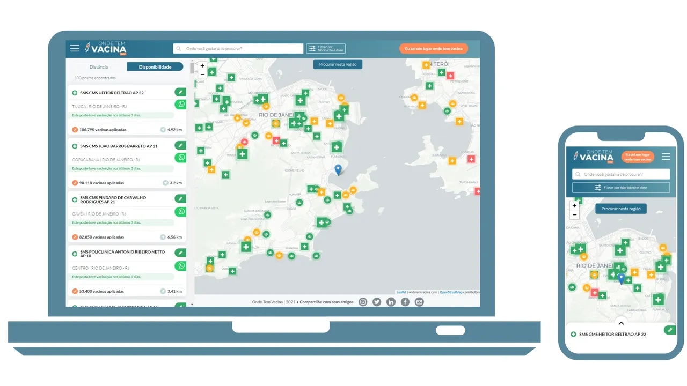
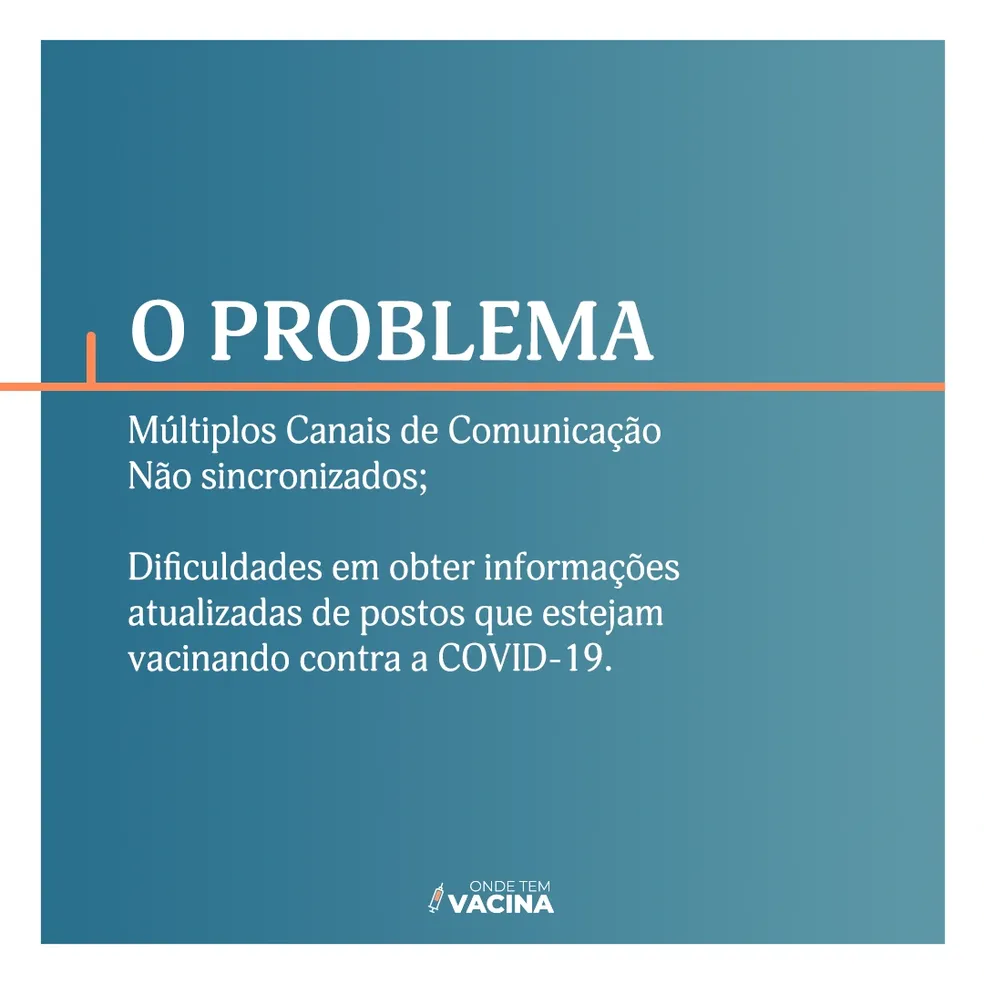
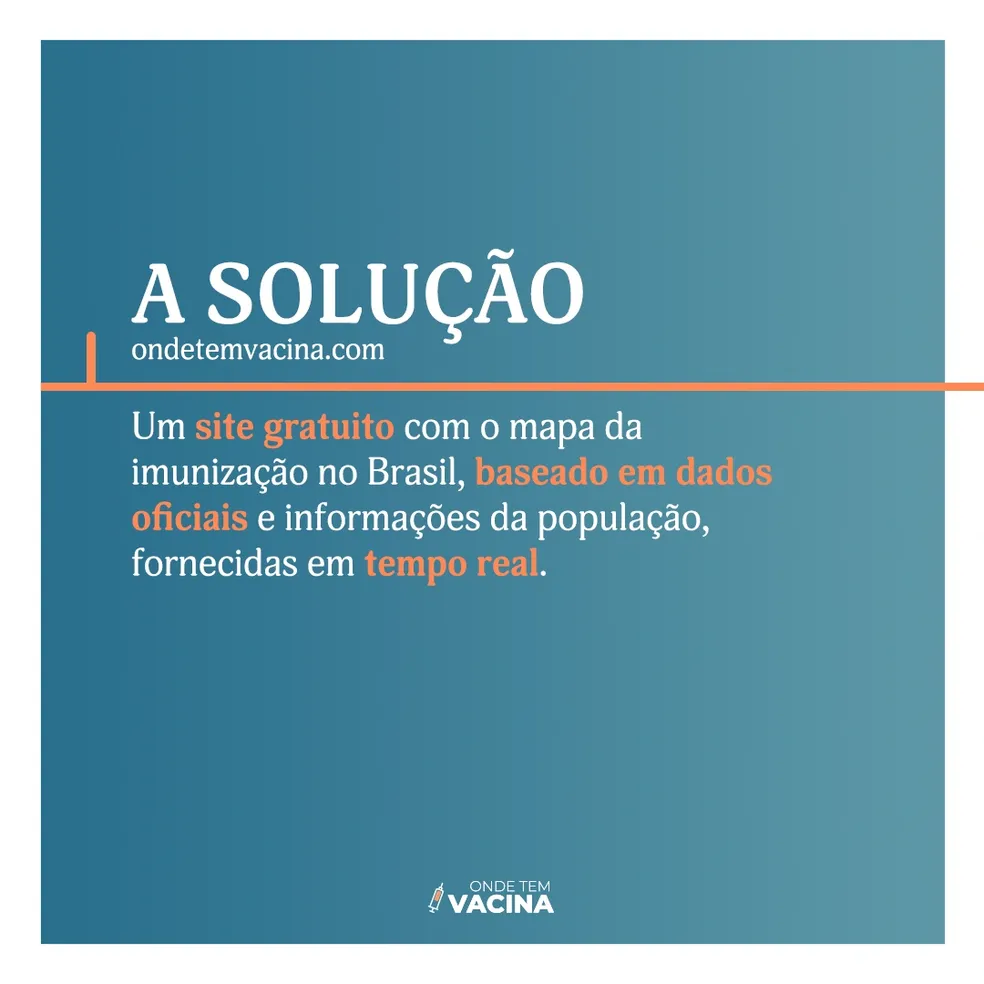
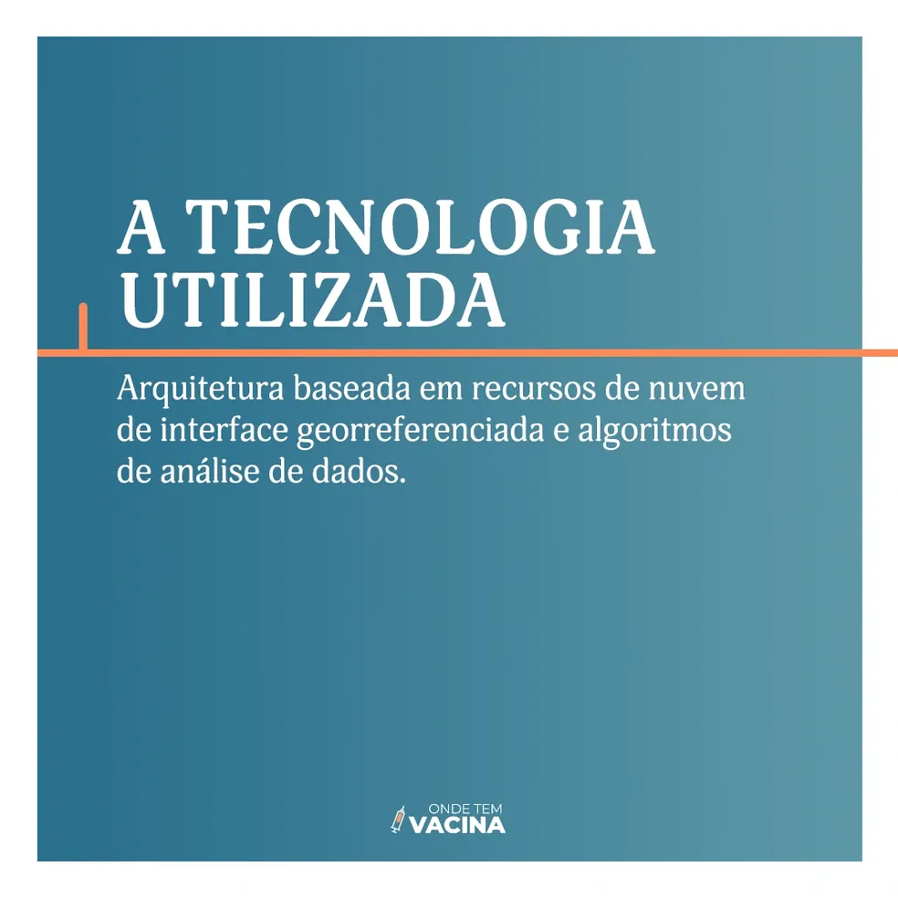
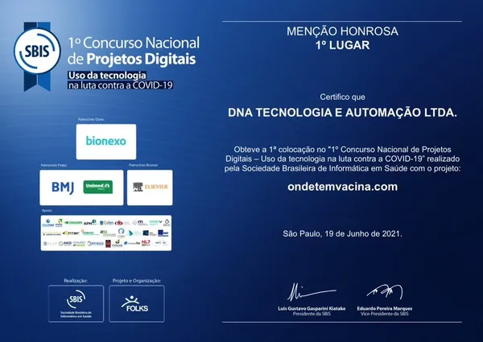
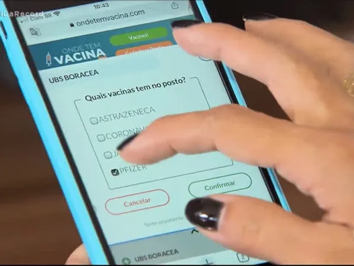
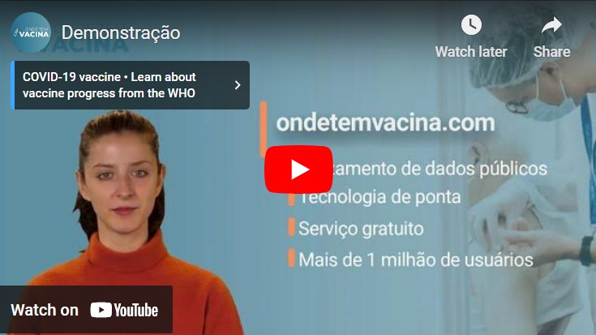

# ondetemvacina against the global pandemic

 
Free collaborative platform for brazilian citizens to search and share details about COVID vaccination places.
## About the project

The motivation to create the project stemmed from realizing the delay and restrictions in Brazil's vaccine procurement; when the country finally acquired the vaccines, it faced difficulties in centralizing information about the available vaccines and identifying which vaccination centers citizens could visit to get them.

In response to the confused situation and the unprecedented challenges brought by the COVID-19 pandemic, our team took the initiative to develop a pro bono project that had a profound impact on the vaccination campaign in Brazil. Launched at a critical moment, our public utility service not only facilitated access to vital vaccination information for millions of Brazilians but also symbolized the power of technology applied for the common good.  

By integrating advanced technology and strategically utilizing open data provided by a government API, we created an interactive mapping platform that located over 26,000 public vaccination sites, spread over more than 5,500 cities in Brazil. In addition, there are about 10,000 "temporary vaccination posts" created by city halls, that are not included in the official published data. The tool, updated daily, provided real-time information on vaccine availability, employing an innovative approach based on historical distribution and consumption data.

Additionally, we embraced the concept of crowdsourcing, allowing the public to actively contribute to the accuracy of the information. This community engagement not only improved the reliability of the data presented but also strengthened the sense of collective responsibility and solidarity among users.  

Our work was recognized with a prestigious national award from the Brazilian Society of Health Informatics (SBIS), highlighting the importance and effectiveness of our solution in a challenging context. With over one million users accessing the platform, according to Google Analytics, we are proud to have made a significant difference in the national vaccination effort.  

This project exemplifies our commitment not only to technological innovation but also to community well-being. It reaffirms our belief in the power of technology as a force for social good, capable of addressing and overcoming the most urgent societal challenges.  
## The solution

 

[version 1.0](https://otv.azurewebsites.net/) &rarr;  
[version 2.0](https://oaas-webapp.azurewebsites.net/) &rarr;
  
 

## Media impact
### 1st place in the National Digital Projects Competition: Use of Technology in the Fight Against COVID-19 by SBIS

 
  
[here](https://www.linkedin.com/feed/update/urn:li:activity:6815731884690063360/) &rarr;
### Volunteer Project Provides Information on Vaccine Availability at Each Health Clinic in the Country by R7 Brazilian TV Channel

 
 
### Volunteer Project Provides Information on Vaccine Availability Nationwide by Agencia Brasil Government Media Social
[here](https://agenciabrasil.ebc.com.br/saude/noticia/2021-07/projeto-de-voluntarios-informa-disponibilidade-de-vacinas-no-pais) &rarr;

### Volunteer Project Reports Vaccine Availability Across the Country - UOL Media Social
[here](https://www.uol.com.br/vivabem/noticias/redacao/2021/07/03/onde-se-vacinar-covid-19-projeto.htm) &rarr;

## Demonstration
Watch a brief demonstration. Duration: 2 minutes 11 seconds.  

 

[here](https://youtu.be/FaD1eoQ-L70) &rarr;

 ## Others
  [Official description about the project on LinkedIn](https://www.linkedin.com/company/onde-tem-vacina/about/) &rarr;
 
